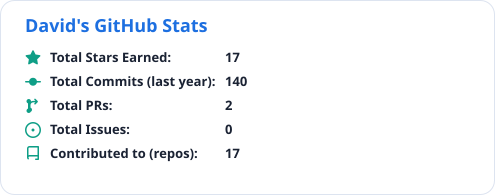
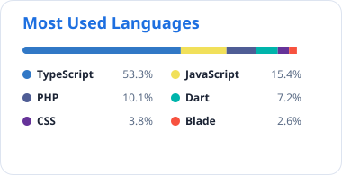
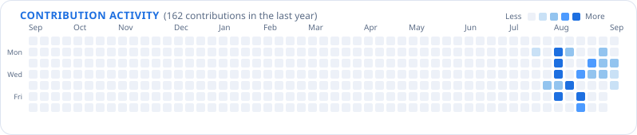
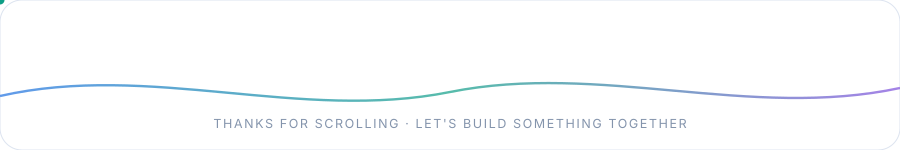

<picture>
  <source media="(prefers-color-scheme: dark)" srcset="assets/banner-dark.svg">
  
</picture>

  

  

<i>Turning rough ideas into clean, functional and good-looking software —
and understanding how every part of it works.</i>

  

<picture>
  <source media="(prefers-color-scheme: dark)" srcset="assets/divider-dark.svg">
  
</picture>

## About

I'm **David Yehuda Surbakti** — a **Grade XI student** at **SMK Bagimu Negeriku**, majoring in
**Software Engineering (Rekayasa Perangkat Lunak)**.

I build things for the web: clean, responsive interfaces on the front — structured APIs, logic and
databases behind them. I combine **code, design and AI-assisted workflows** to turn rough ideas into
working, maintainable products, faster, without losing the understanding of *how* they work.

| Name | Age | Grade | Location |
| :--- | :-: | :-: | :--- |
| David Yehuda Surbakti | 15 | XI · RPL | Semarang, Indonesia |

 

<picture>
  <source media="(prefers-color-scheme: dark)" srcset="assets/divider-dark.svg">
  
</picture>

## What I build

<table>
<tr>
<td width="50%" valign="top">

#### Web Development

Modern, responsive websites with clean interfaces, structured code and attention to detail on
functionality and user experience.

 

</td>
<td width="50%" valign="top">

#### Application Development

Apps built on modern frameworks — focused on usability, architecture and clean API integration.

 

</td>
</tr>
<tr>
<td width="50%" valign="top">

#### UI/UX Design

Interfaces built around usability, visual hierarchy and consistency — from wireframe to an
interactive prototype.

 

</td>
<td width="50%" valign="top">

#### AI-Assisted Development

AI as a development partner for research, coding, debugging, docs and workflow — not as a
replacement for thinking.

 

</td>
</tr>
</table>

 

<picture>
  <source media="(prefers-color-scheme: dark)" srcset="assets/divider-dark.svg">
  
</picture>

## Tech stack

<!-- Animated logo rows: hand-drawn SVG + SMIL, self-hosted in this repo.
     React spins, MySQL ripples, Docker rocks on a wave, Figma bounces, Laravel extends…
     Regenerate: python3 scripts/render_theme.py -->

<picture>
  <source media="(prefers-color-scheme: dark)" srcset="assets/stack-1-dark.svg">
  
</picture>

 

<picture>
  <source media="(prefers-color-scheme: dark)" srcset="assets/stack-2-dark.svg">
  
</picture>

 

<picture>
  <source media="(prefers-color-scheme: dark)" srcset="assets/stack-3-dark.svg">
  
</picture>

  

#### AI assistants & other tools

 

<picture>
  <source media="(prefers-color-scheme: dark)" srcset="assets/divider-dark.svg">
  
</picture>

## GitHub activity

<!-- generated/*.svg are rebuilt daily by the "Generate profile cards" workflow
     (scripts/render_cards.py + the GitHub GraphQL API) — no third-party card service needed.
     Workflow source: ops/generate-cards.yml, to be moved to .github/workflows/ to activate.
     Both palettes are written so <picture> can match the visitor's GitHub theme. -->

<picture>
  <source media="(prefers-color-scheme: dark)" srcset="generated/stats.svg">
  
</picture>
<picture>
  <source media="(prefers-color-scheme: dark)" srcset="generated/top-langs.svg">
  
</picture>

  

<picture>
  <source media="(prefers-color-scheme: dark)" srcset="https://streak-stats.demolab.com/?user=davidyehuda45-byte&hide_border=true&border_radius=14&background=0E1729&border=1E2E4A&stroke=C9D6EA&ring=4D9BFF&fire=34E2C5&currStreakNum=34E2C5&currStreakLabel=4D9BFF&sideNums=C9D6EA&sideLabels=8FA3BF&dates=8FA3BF">
  
</picture>

  

<picture>
  <source media="(prefers-color-scheme: dark)" srcset="https://github-profile-trophy-orcin-eta.vercel.app/?username=davidyehuda45-byte&theme=onedark&no-frame=true&row=1&column=7&margin-w=15">
  
</picture>

  

<picture>
  <source media="(prefers-color-scheme: dark)" srcset="generated/calendar.svg">
  
</picture>

 

<picture>
  <source media="(prefers-color-scheme: dark)" srcset="assets/divider-dark.svg">
  
</picture>

## Philosophy

### "Build it. Break it. Understand it. Improve it."

Good software isn't only about making something work. A product grows through a sequence:

**Functional → Maintainable → Scalable → Usable → Beautiful**

I believe development is a continuous loop of **learning, experimenting, solving problems and
refining the result** — one iteration at a time.

 

<picture>
  <source media="(prefers-color-scheme: dark)" srcset="assets/divider-dark.svg">
  
</picture>

## How I work

<table>
<tr>
<th width="16%">01</th>
<th width="16%">02</th>
<th width="16%">03</th>
<th width="16%">04</th>
<th width="16%">05</th>
<th width="16%">06</th>
</tr>
<tr>
<td align="center"><b>Plan</b></td>
<td align="center"><b>Assist</b></td>
<td align="center"><b>Build</b></td>
<td align="center"><b>Test</b></td>
<td align="center"><b>Debug</b></td>
<td align="center"><b>Ship</b></td>
</tr>
<tr>
<td align="center">Define goals, flow &amp; structure</td>
<td align="center">Use AI for research &amp; ideation</td>
<td align="center">Write clean, structured code</td>
<td align="center">Validate features &amp; edge cases</td>
<td align="center">Fix, refine and optimize</td>
<td align="center">Deploy, document, maintain</td>
</tr>
</table>

My workflow mixes traditional programming practice with **modern AI-assisted tooling** — to move
faster while keeping the output structured, readable and easy to maintain.

 

<picture>
  <source media="(prefers-color-scheme: dark)" srcset="assets/divider-dark.svg">
  
</picture>

## Currently focusing

 

<picture>
  <source media="(prefers-color-scheme: dark)" srcset="assets/divider-dark.svg">
  
</picture>

## Let's connect

  

<i>Open for collaboration, learning and interesting ideas.</i>

  

<picture>
  <source media="(prefers-color-scheme: dark)" srcset="assets/footer-dark.svg">
  
</picture>
