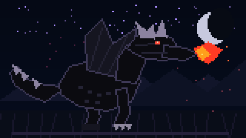

<div align="center">

# David Yehuda Surbakti

### Web Developer · Laravel · Flutter · Creative Coding

<p>
Membangun website dan aplikasi dengan fokus pada tampilan yang bersih,
fungsional, dan nyaman digunakan.
</p>



<br>

`BLACK DRAGON // SYSTEM ONLINE`

</div>

---

## Tentang Saya

Saya adalah siswa SMK yang sedang mengembangkan kemampuan di bidang
web development, mobile development, dan pemrograman.

Saat ini saya banyak menggunakan:

- **PHP & Laravel** untuk pengembangan web
- **Dart & Flutter** untuk aplikasi mobile
- **JavaScript** untuk interaksi web
- **C++** untuk pemrograman dan logika
- **HTML & CSS** untuk membangun antarmuka
- **Tailwind CSS & Bootstrap** untuk styling
- **Blade** sebagai templating pada Laravel

Saya juga tertarik menggabungkan pemrograman, desain antarmuka,
dan eksperimen visual menjadi proyek yang benar-benar bisa digunakan.

---

## Tech Stack

### Web Development

<p>


</p>

### Mobile Development

<p>


</p>

### Frontend & Styling

<p>


</p>

### Programming

<p>

</p>

---

## GitHub Statistics

<div align="center">

<a href="https://github.com/davidyehuda45-byte">

</a>

<a href="https://github.com/davidyehuda45-byte">

</a>

</div>

---

## Aktivitas GitHub

<div align="center">


</div>

---

## Proyek

| Proyek | Teknologi | Fokus |
|---|---|---|
| Web Application | Laravel, PHP | MVC, CRUD, Database |
| Mobile Application | Flutter, Dart | Aplikasi Android |
| Interactive Website | HTML, CSS, JavaScript | UI & Interaksi |
| Programming Projects | C++ | Logika & Algoritma |

---

## Fokus Pengembangan

```text
Laravel        ███████████████████░░
Flutter        ████████████████░░░░░
JavaScript     ███████████████░░░░░░
UI / UX        █████████████░░░░░░░░
C++            ███████████░░░░░░░░░░
```

---

<details>
<summary>Lebih lanjut tentang teknologi yang saya gunakan</summary>

### Laravel

Digunakan untuk membangun aplikasi web dengan konsep MVC,
routing, database, authentication, dan CRUD.

### Flutter

Digunakan untuk membuat aplikasi mobile dengan Dart dan
satu codebase.

### JavaScript

Digunakan untuk membuat interaksi dan perilaku dinamis
pada website.

### C++

Digunakan untuk memperkuat pemahaman logika pemrograman,
algoritma, dan struktur program.

</details>

---

<div align="center">

### Build. Break. Debug. Build Again.

<a href="https://github.com/davidyehuda45-byte">

</a>

</div>
