  

  

<i>Turning ideas into clean, functional and beautiful software.</i>

  

 

## `01` &#183; WHOAMI

I'm **David Yehuda Surbakti** — a **Grade XI student** at **SMK Bagimu Negeriku**, majoring in
**Software Engineering (Rekayasa Perangkat Lunak)**.

I build things for the web: clean, responsive interfaces on the front — structured APIs, logic and
databases behind them. I combine **code, design and AI-assisted workflows** to turn rough ideas into
working, maintainable digital products, faster, without losing the understanding of *how* they work.

 

| `NAME` | `AGE` | `GRADE` | `LOCATION` |
| :---: | :---: | :---: | :---: |
| David Yehuda Surbakti | 15 | XI &#183; RPL | Indonesia |

 

## `02` &#183; WHAT I DO

<table>
<tr>
<td width="50%" valign="top">

#### `>_` Web Development

Building modern and responsive websites with a focus on clean interfaces, structured code,
functionality and user experience.

 

</td>
<td width="50%" valign="top">

#### `>_` Application Development

Developing applications with modern frameworks — focused on usability, architecture and smooth
API integration.

 

</td>
</tr>
<tr>
<td width="50%" valign="top">

#### `>_` UI/UX Design

Designing interfaces that focus on usability, visual hierarchy, consistency and modern aesthetics —
from wireframe to interactive prototype.

 

</td>
<td width="50%" valign="top">

#### `>_` AI-Assisted Development

Using AI as a development partner for research, coding, debugging, documentation and workflow
optimization — not as a replacement for thinking.

 

</td>
</tr>
</table>

 

## `03` &#183; TECH STACK

<table>
<tr>
<td align="center" width="50%">

#### Languages

</td>
<td align="center" width="50%">

#### Frameworks &amp; Libraries

</td>
</tr>
<tr>
<td align="center" width="50%">

#### Database &amp; Tools

</td>
<td align="center" width="50%">

#### IDE &amp; Deployment

</td>
</tr>
</table>

 

#### AI Assistants &amp; Other Tools

 

## `04` &#183; GITHUB ACTIVITY

 

  

  

 

## `05` &#183; PHILOSOPHY

### `"Build it. Break it. Understand it. Improve it."`

Good software is not only about making something work.
A good product grows through a sequence:

 

  

I believe development is a continuous loop of **learning, experimenting, solving problems and
refining the result** — one iteration at a time.

 

## `06` &#183; WORKFLOW

<table>
<tr>
<th width="16%" align="center"><code>01</code></th>
<th width="16%" align="center"><code>02</code></th>
<th width="16%" align="center"><code>03</code></th>
<th width="16%" align="center"><code>04</code></th>
<th width="16%" align="center"><code>05</code></th>
<th width="16%" align="center"><code>06</code></th>
</tr>
<tr>
<td align="center"><b>PLAN</b></td>
<td align="center"><b>ASSIST</b></td>
<td align="center"><b>BUILD</b></td>
<td align="center"><b>TEST</b></td>
<td align="center"><b>DEBUG</b></td>
<td align="center"><b>SHIP</b></td>
</tr>
<tr>
<td align="center">Define goals, flow &amp; structure</td>
<td align="center">Use AI for research &amp; ideation</td>
<td align="center">Write clean, structured code</td>
<td align="center">Validate features &amp; edge cases</td>
<td align="center">Fix, refine and optimize</td>
<td align="center">Deploy, document, maintain</td>
</tr>
</table>

 

My workflow mixes traditional programming practice with **modern AI-assisted tooling** — to move
faster while keeping the output structured, readable and easy to maintain.

 

## `07` &#183; CURRENT FOCUS

 

 

## `08` &#183; LET'S CONNECT

 

  

<i>Open for collaboration, learning and interesting ideas.</i>

 

